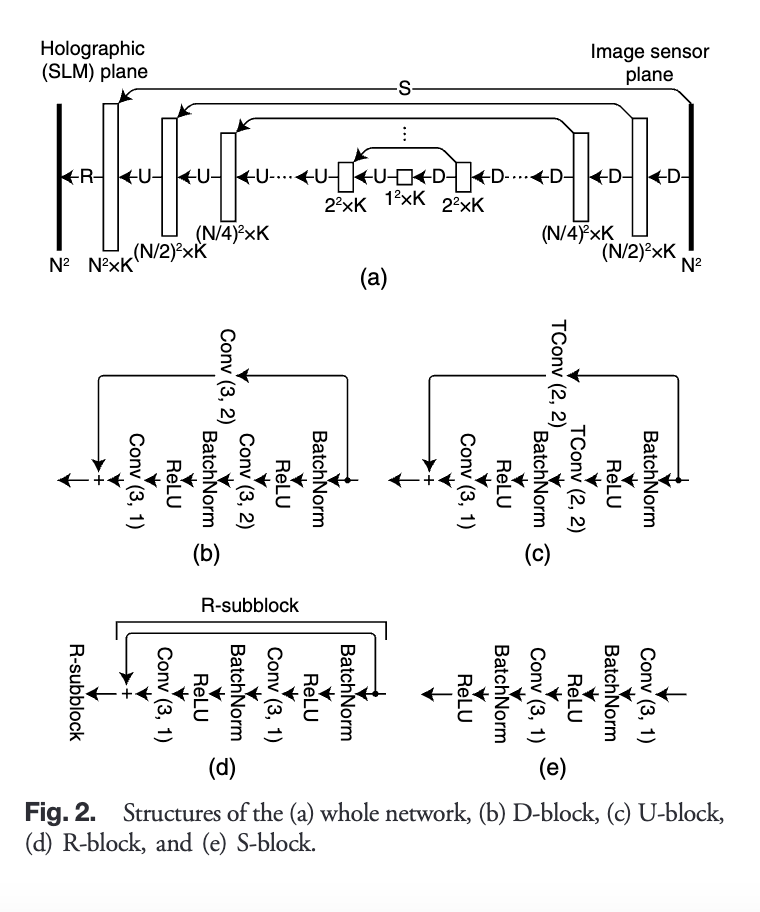
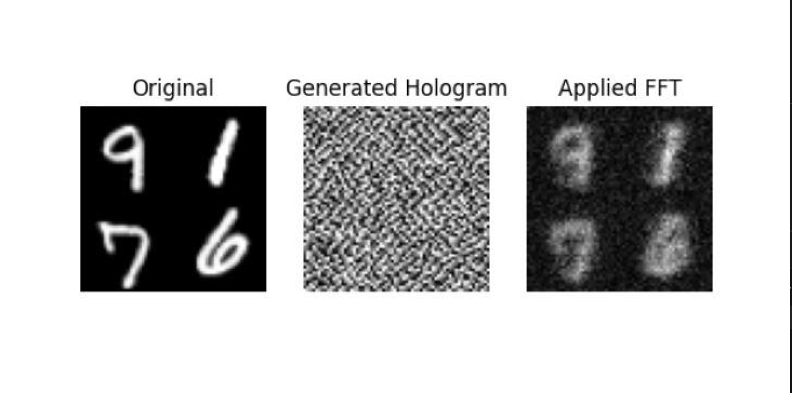
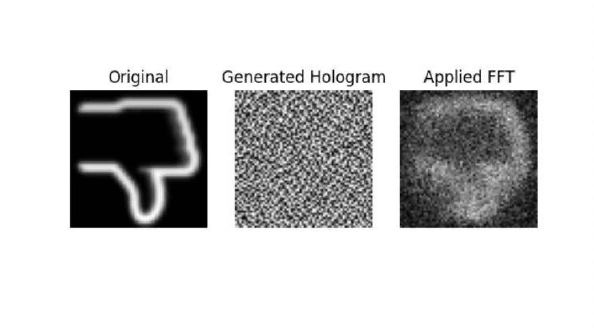

# ResNet To Predict Holograms For 3D Holography.

## Background
Based on this [paper](../papers/horisaki2018%201.pdf)

Below is the model's architecture from the paper:

## Different Set-up
Aside from configurable hyperparameters, there are some changes that is fundamental to the model and may affect supporting files. These are therefore split into different folders. Their structures are very similar, albeit some computational and logical code changes. 

We experimented with final activation function before output:
1. Tanh Activation (Output hologram pixel values between -1 and 1)
2. Sigmoid Activation (Output hologram pixel values between 0 and 1)

As well as how the cost is computed (what it is compared against):

Note: (Computational) Reconstructed can be obtained by applying fresnel propagation (or some similar function based on fourier transform) to the hologram.

Actual reconstruction involves an expensive laser set-up.

1. Using holograms labels. These holograms are generated using Gerchberg-Saxton algorithm 
    - Gerchberg-Saxton is an iterative algorithm to produce hologram from the target images. The reconstructed image based on Gerchberg-Saxton is clear, but with some noise. More crucial, the algorithm does not scale well (time) with image size.
    - You might notice the loss function is actually a weighted loss comprising of the above and loss between original targets and reconstructed.
2. No labels. So the cost is computed by comparing between the original targets and the reconstructed targets

- Tanh Activation function with Loss computed between target and reconstructed. See [here](./tanh_reconstructed/).
- Sigmoid Activation function with Loss computed between target and reconstructed. See [here](./sigmoid_reconstructed/).
- Tanh Activation function with Loss computed involving hologram labels. See [here](./tanh_hologram/).
- Sigmoid activation function with Loss computed involving hologram labels. See [here](./sigmoid_hologram/).

## Dataset Generator
Every folder has a `dataset_generator.py`. Note that only the reconstructed folders support icon generation because it is empirically better.
- However, it should be noted that we were slightly biased towards having more experiments with reconstructed.
    - One reason is because hologram construction is not unique. And slight deviation (e.g. adding gaussian noise) to hologram might cause reconstructed output (after applying fresnel) to be barely visible.
- It does seem empirically better but we actually haven't experimented much with MSELoss and hologram labels.

### Generating the dataset
At the top of the file (`dataset_generator.py`), there is a USER_CONFIG section. There you can specify 
1. the total `NUM_IMAGES`
2. The `RATIOS` between different types of images (e.g. Digits, Icons, Random Targets)
3. The `FILENAME`. Note that the directory in which the data is saved is also configurable with `DATA_DIR`
4. `RESOURCE_DIR` may or may not exist, depending if external resources (e.g. icons) is needed.

**Note existing datasets with same name and format will be overwritten.**

## Hyperparameters / Configurations
Refer to `config.py`. There are several configurations that can be made:
1. `DTYPE_TORCH` and `DTYPE_NP`. They should be the data-type equivalent of each other
    - 64 offers greater precision but might not be space-efficient. 32 might be sufficient, but more experiments can be made to determine.
2. `IMAGE_SIZE`. Model architecture is dynamically resized based on this parameter.

**Note: Make sure a new dataset is generated (`dataset_generator.py`) for any changes to the above!**

3. `EPOCHS`
4. `LEARNING_RATE`
5. `TRAIN_BATCH_SIZE`
6. `LOSS_FN`
    - MSELoss is found to perform better, likely due to smoothing and inherent scaling unlike L1
7. `INITIALIZER`
    - Note this initializes the intermediate weights of the model that uses ReLU activation. By default it is `He initialization`.
    The initializer for the final layer is not made configurable (because we don't see why there's a need to). But if you wish to change it, inspect `model.py` file (specifically, `RBlock` class).
    - Sigmoid activation function uses `Xavier initialiation` and Tanh uses `LeCun initialization`.
8. `GAMMA`
    - The decay of the learning rate.
9. `MILESTONES`
    - When `GAMMA` factor is applied.
10. Optional Customizable Stuff
    - You can implement your own custom loss function or Scaler in the config.py and import them in the necessary files (e.g. `train.py`, `predict.py`, `model.py`)

## Resume Training
There is a folder [`training_resumption/`](./training_resumption/) that allows you to specify a saved model path to load and resume training from there. But it is not very user-friendly and is more for backend development. 

You can specify which saved model path (and data path) to use in `resume_train.py`. But note you'll likely have to duplicate the corresponding `model.py` into `training_resumption/` folder. We could import it, but that involves modularizing the structure. It isn't too difficult to do so. See [here](https://medium.com/@ramrajchandradevan/python-init-py-modular-imports-81b746e58aae) if you want to find out how. 

## Train.py
By default, NO_SCALER (Identity Scaler) is used. You can navigate down to the `__main__` block of the code and comment the corresponding lines to use scaler. If scaler is used, but not specified, it defaults to Min-Max Scaler.

## Display.py
This is actually a file we intended to remove because it is more for backend experimentation and observation of results. But we decided to leave it in to see the progression in the clarity of digits reconstructed.

If you navigate to `evaluate_model` method in `train.py`, there is a section that saves the predicted hologram (and reconstruction) of the first image of the validation set at every epoch. Note you will see the same image over and over because shuffling is set to false for validation set.

After training (or even if you pre-mature terminate), you can run `display.py` and observe the progression across the epochs.

## Predict.py
Change `DATASET_PATH` to where your test dataset is stored and run the file to observe predicted hologram and reconstructed of each instance in your dataset.

## Best Model
More experiments can be done, but the best we have thus far is from tanh_reconstructed. Either `80_epochs` or `30000_train` or `icon_digits`. Below is a sample:

## Credits
- Dr Xie
- Andre
- Todd